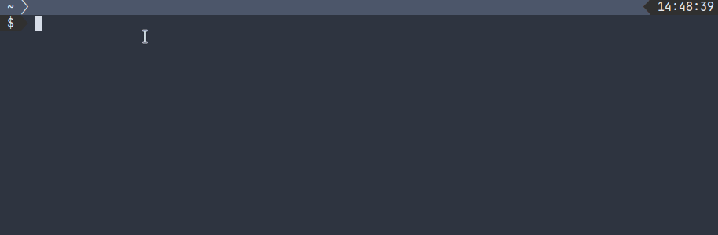

# Powerline Tailscale

A Powerline segment for showing the status of Tailscale.



Since Tailscale doesn't (seemingly) have a configuration file where it reads and stores state, this segment implementation relies on the `tailscaled` API server. I haven't found any official documentation regarding it, but its capabilities are available [here](https://github.com/tailscale/tailscale/blob/c08cf2a9c6209e4fdef896921af66bbe737b8a24/ipn/localapi/localapi.go). There exists a Python library to interact with this API in limited form called ['tailscale-localapi'](https://github.com/apognu/tailscale-localapi), though I decided against using it because I didn't want to introduce any Python-specific dependencies; this is something I may reconsider in the future keeping in mind that the current implementation relies on `curl` instead.

## Requirements

Besides having Tailscale installed according to the [official documentation](https://tailscale.com/kb/installation/), it is also necessary to install `curl` at either 7.40.0 or above, which is when the `--unix-socket` flag was introduced. You can check your version of `curl` with the `--version` flag:

```console
$ curl --version
curl 7.85.0 (x86_64-redhat-linux-gnu) libcurl/7.85.0 OpenSSL/3.0.9 zlib/1.2.12 brotli/1.0.9 libidn2/2.3.4 libpsl/0.21.1 (+libidn2/2.3.3) libssh/0.10.5/openssl/zlib nghttp2/1.51.0
Release-Date: 2022-08-31
Protocols: dict file ftp ftps gopher gophers http https imap imaps ldap ldaps mqtt pop3 pop3s rtsp scp sftp smb smbs smtp smtps telnet tftp 
Features: alt-svc AsynchDNS brotli GSS-API HSTS HTTP2 HTTPS-proxy IDN IPv6 Kerberos Largefile libz NTLM NTLM_WB PSL SPNEGO SSL threadsafe TLS-SRP UnixSockets
```

If `curl` or Tailscale isn't installed or `tailscaled` isn't running, then installing and configuring this segment will have no effect.

## Installation

Using Pip:

```bash
pip install powerline-tailscale
```

## Configuration

Only three highlight groups are necessary to be defined in order for `powerline-tailscale` to work. These can be set up in `~/.config/powerline/colorschemes/default.json`. You are free to choose any colors you want.

```json
{
  "name": "Default",
    "groups": {
      "tailscale":                 { "fg": "white", "bg": "gray2","attrs": [] },
      "tailscale_exitnode":        { "fg": "white", "bg": "steelblue","attrs": [] },
      "tailscale:divider":         { "fg": "white", "bg": "steelblue", "attrs": [] }
    }
}
```

After that, add the segment's configuration by modifying the relevant Powerline theme. If you are using the default, then in `~/.config/powerline/themes/shell/default.json`:

```json
{
  "function": "powerline_tailscale.tailscale",
    "args": {
      "show_profile_name": true,
      "show_exit_node_status": false,
      "show_exit_node": true
  }
}
```

Now, just reload Powerline using `powerline-daemon --replace`.

### Options

* `show_profile_name` shows either:
  * "logged out" if `tailscaled` is running, but no account is logged in;
  * "default" if no profile is created, i.e. the log-in hasn't been done with `tailscale login --nickname=<name>`;
  * or the name of the profile itself;
* `show_exit_node_status` shows a boolean "exit node (y)" or "exit node (n)" depending on whether connected to an exit node through `tailscale up --exit-node="<IP>"`
* `show_exit_node` shows the actual IP address of the exit node as given to `tailscale up --exit-node="<IP>"`
  * the `show_exit_node_status` option needs to be set to `false` when this option is set to `true`
  * if not connected to an exit node, then "exit node (n)" is shown

### Disabling

By default the segment will always be displayed, but you may wish to toggle it instead. This can be done through a Bash function, which unsets or sets an environment variable that the segment reads:

```bash
function plts() {
  if [[ $POWERLINE_TAILSCALE = "0" ]]; then
    unset POWERLINE_TAILSCALE
  else
    export POWERLINE_TAILSCALE=0
  fi
}
```

You can add this function to your `~/.bashrc` file, source it using `source ~/.bashrc`, and then toggle the segment using `plts` or whatever you chose for the name of the function. This function name can also be Tab-completed.

If you want to start your shell sessions _without_ having this segment, then add `export POWERLINE_TAILSCALE="0"` somewhere in `~/.bashrc`.
